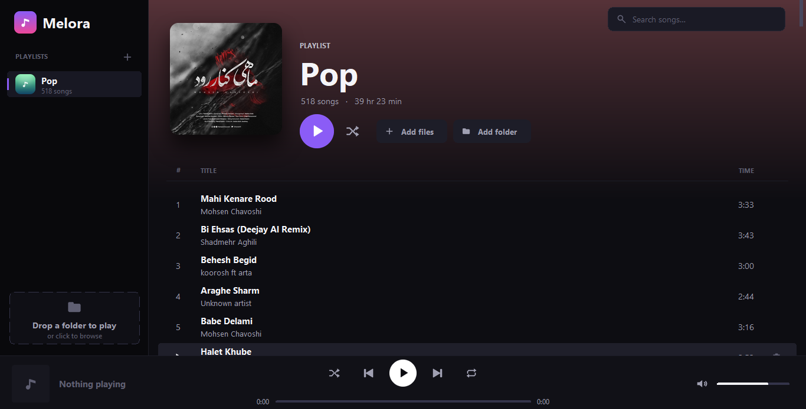

<section style="max-width:700px; margin:auto; font-family:Arial, sans-serif; line-height:1.7; color:#333;">
  <h1 style="text-align:center; color:#2c3e50;">Melora Music Player</h1>
  

  <p align="center">
  
  </p>
</section>

<h2>About</h2>
<p>Melora is a lightweight desktop music player for Windows, built with Python.

The goal of the project is to provide a clean and simple way to play and manage local music files while keeping the application lightweight and easy to use.

Melora uses Python libraries such as Pygame, Mutagen, Pillow, and TkinterDnD2 for audio playback, metadata handling, image processing, and drag-and-drop functionality.

The project is also part of my experience with building, packaging, and distributing Python desktop applications for Windows.</p>


<h2>Download</h2>

<p>Get the latest Windows installer:

<p>
  <a href="https://github.com/mhmdheydarii/MELORA-MUSIC-PLAYER/releases/download/v1.0.0/Melora.exe">
    Download Melora.exe
  </a>
</p>


<h2>Features</h2>
<ul>
   <li>Play local music files</li>
   <li>Playlist management</li>
   <li>Drag & Drop support</li>
   <li>Volume and playback controls</li>
   <li>Shuffle and repeat playback</li>
   <li>Windows standalone installer</li> 
</ul>


<h2>Technologies</h2>
<ul>
  <li>Python</li>
  <li>Pygame</li>
  <li>Tkinter</li>
  <li>TkinterDnD2</li>
  <li>Mutagen</li>
  <li>Pillow</li>
  <li>PyInstaller</li>
</ul>


<h2>⚙️ Installation (Windows)</h2>

<p>Follow these steps to set up and run the project locally.</p>

<hr>

<h3>1. Clone the repository</h3>

```bash
git clone https://github.com/mhmdheydarii/Melora-Music-Player.git
```

<br>

<h3>2. Navigate to the project directory</h3>

```bash
cd Melora-Music-Player
```

<br>

<h3>3. Create a virtual environment</h3>

```bash
python -m venv .venv
```

<br>

<h3>4. Activate the virtual environment</h3>

<p><b>CMD</b></p>

```cmd
.venv\Scripts\activate
```

<p><b>PowerShell</b></p>

```powershell
.\.venv\Scripts\Activate.ps1
```

<p>
After activation, you should see something similar to:
</p>

```bash
(.venv)
```

<p>
at the beginning of your terminal line.
</p>

<br>

<h3>5. Install dependencies</h3>

<p>If the project includes a <code>requirements.txt</code> file:</p>

```bash
pip install -r requirements.txt
```

<br>


<h3>6. Run the project</h3>

```bash
python src/melora.py
```

<hr>

<details>
<summary><b>❌ Deactivate Virtual Environment</b></summary>

<br>

To exit the virtual environment:

```bash
deactivate
```

</details>

<br>

<p align="center">
⭐ If you found this project useful, consider giving it a star.
</p>
